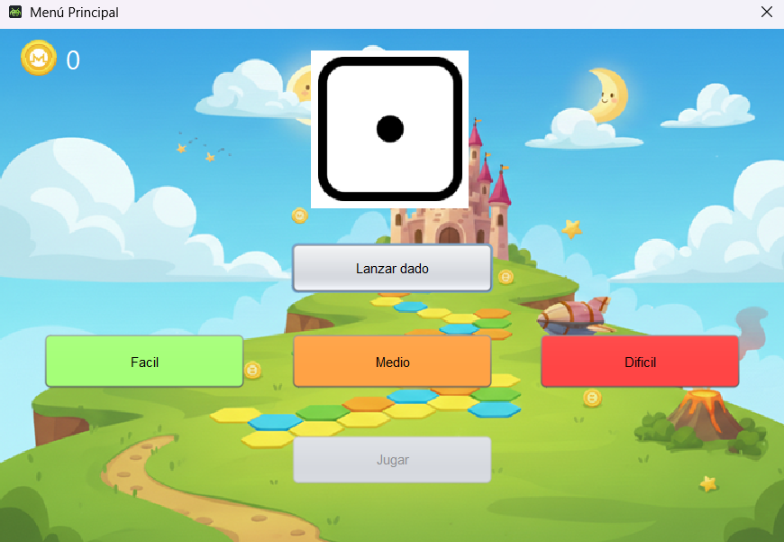
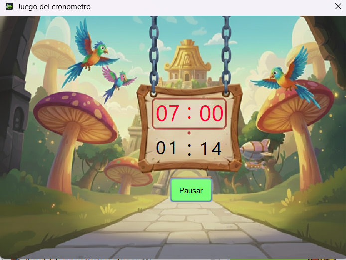

# Sala de Minijuegos para escritorio ambientado en Mario Bros

Proyecto de minijuegos desarrollado en Java, ofrece al usuario la posibilidad de poner a prueba sus capacidades en diferentes retos

  

## Juegos Incluidos

	### Juego de Memoria (Tarjetas)
		
		* Descripción: Encuentra todas las parejas de cartas antes de que se agote el tiempo.
		* Mecánica: Uso de hilos independientes para la barra de progreso y gestión de eventos para el volteo de cartas.

	### El Cronómetro 	
		
		* Descripción: Detén el cronometro en el objetivo para conseguir la victoria.
		* Mecánica: Detén el cronómetro en el segundo exacto marcado como objetivo. Incluye diferentes niveles de dificultad con márgenes de error ajustables.

	### Simón dice

		* Descripción: Repite la secuencia de colores que genera la aplicación.
		* Mecánica: Lógica de arrays dinámicos y reproducción de secuencias mediante hilos sincronizados.

  

## Tecnologías Utilizadas

	*  Lenguaje: Java 17+
	*  IDE: NetBeans
	*  Librería Gráfica: Java Swing & AWT
	*  Gestión de Concurrencia: `javax.swing.Timer` y `Thread` para evitar el bloqueo de la interfaz.

## Instalación y Ejecución
	
*  Ejecutable: [Descargar Instalador (.exe)](instalador/Instalador_Minijuegos.exe)
*  Código fuente: El código completo se encuentra comprimido en [src/minijuegos.zip](src/minijuegos.zip)

## Contribuidores
	
	* David Andrés Pérez: Login, Tarjetas y Cronometro
	* Ángel Valentín Pérez: Pagina principal y Simón dice
